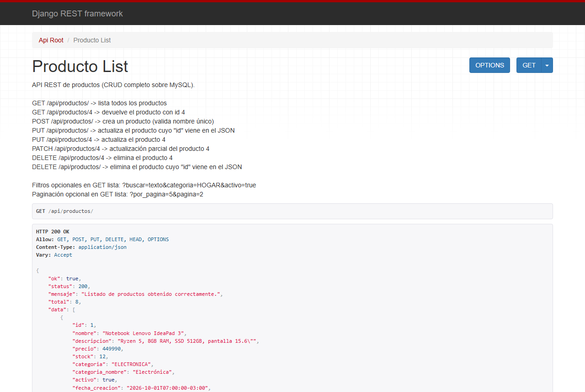
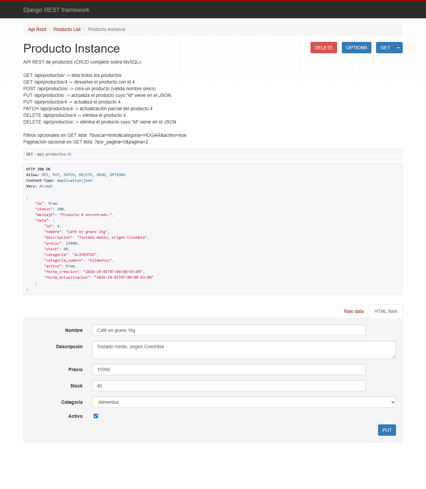
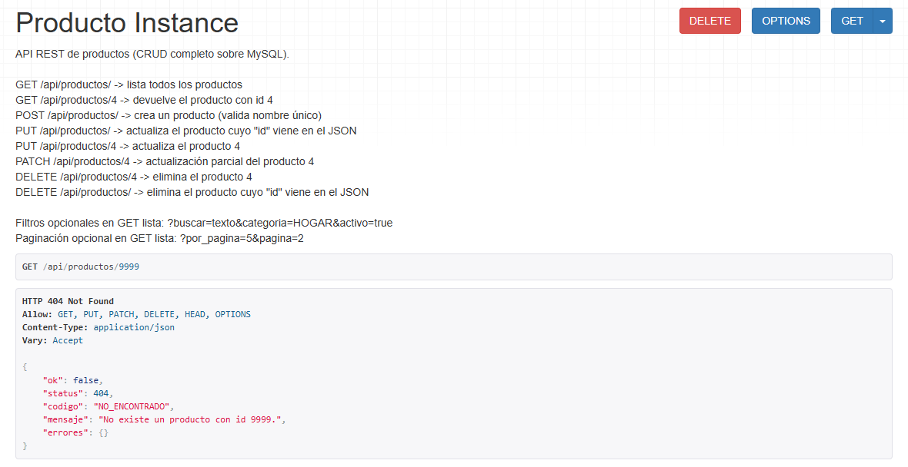
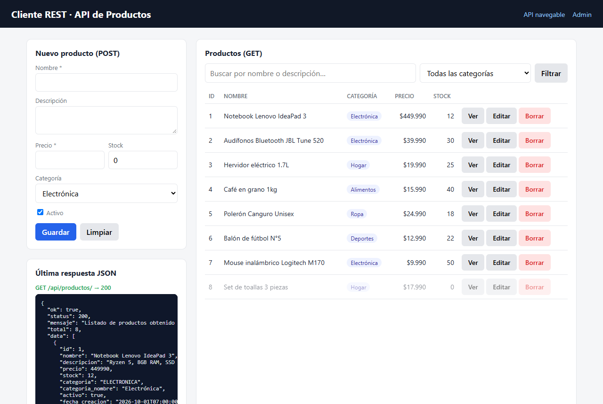
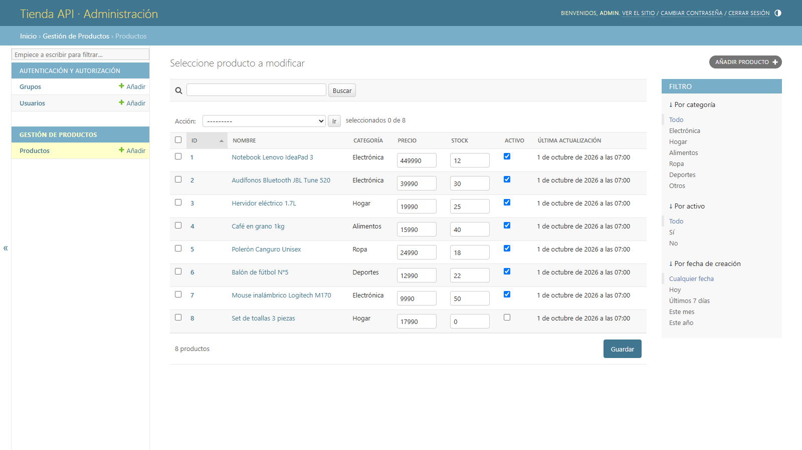
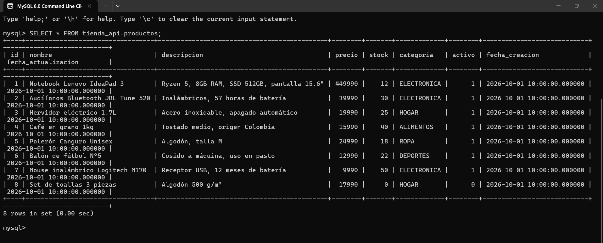

# DOCUMENTACIÓN — Tienda API (Evaluación 3, Programación Backend)

API RESTful hecha con **Django + Django REST Framework (DRF)** y base de datos **MySQL**.
Permite **crear, listar, actualizar y borrar** productos, y todas sus respuestas (de éxito
y de error) son **JSON**.

## Índice

1. [Cumplimiento de la rúbrica](#1-cumplimiento-de-la-rúbrica)
2. [Tecnologías y versiones](#2-tecnologías-y-versiones)
3. [Estructura del proyecto](#3-estructura-del-proyecto)
4. [Requisitos previos](#4-requisitos-previos)
5. [Instalación paso a paso (cualquier PC)](#5-instalación-paso-a-paso-cualquier-pc)
6. [Variables de entorno (configuración)](#6-variables-de-entorno-configuración)
7. [Endpoints de la API](#7-endpoints-de-la-api)
8. [Cómo probar el proyecto](#8-cómo-probar-el-proyecto)
9. [Cómo funciona el código](#9-cómo-funciona-el-código)
10. [Guía de revisión y evidencias](#10-guía-de-revisión-y-evidencias)
11. [Mejoras aplicadas tras la auditoría](#11-mejoras-aplicadas-tras-la-auditoría)
12. [Problemas comunes](#12-problemas-comunes)
13. [Notas de seguridad](#13-notas-de-seguridad)

---

## 1. Cumplimiento de la rúbrica

> Enlaces directos a cada línea de código y capturas de la API funcionando con MySQL:
> [sección 10, Guía de revisión y evidencias](#10-guía-de-revisión-y-evidencias).

| Criterio (20 pts c/u) | Dónde se cumple |
|---|---|
| **Implementa DRF según requerimiento**: DRF, settings, MySQL, librerías | `requirements.txt` (Django, djangorestframework, PyMySQL); `config/settings.py` (`rest_framework` y `productos` en `INSTALLED_APPS`, `DATABASES` con `django.db.backends.mysql`, bloque `REST_FRAMEWORK`); `config/__init__.py` (conector PyMySQL) |
| **Salidas JSON y CRUD con MySQL** | `productos/views.py` (`ProductoViewSet`): GET lista y por id, POST con nombre único, PUT con id en el JSON (404 JSON si no existe), DELETE; `productos/exceptions.py`: todos los errores en JSON |
| **Vistas, rutas y admin con ViewSet** | `ProductoViewSet(viewsets.ModelViewSet)`; `productos/urls.py` (router de DRF); `productos/admin.py` (admin completo); cliente REST web en `/` y colección de Postman |

Requisitos puntuales del enunciado:

| Enunciado | Implementación |
|---|---|
| `GET Productos/` → todos los productos | `GET /api/productos/` |
| `GET Productos/4` → solo el producto 4 | `GET /api/productos/4` (con o sin `/` final) |
| `POST Productos/` → agrega, validando que el nombre no exista | `POST /api/productos/` → 400 si el nombre ya existe (sin distinguir mayúsculas ni espacios) |
| `PUT Productos/` → actualiza según el JSON; si el id no existe, error en JSON | `PUT /api/productos/` con `{"id": 4, ...}` → 404 `PRODUCTO_NO_ENCONTRADO` si no existe |
| `DELETE Productos/4` → elimina | `DELETE /api/productos/4` (o `DELETE /api/productos/` con `{"id": 4}`) |
| Cada endpoint devuelve JSON (éxito o fracaso) | Formato estándar `{"ok", "status", "mensaje", ...}` en todas las respuestas |
| Vistas para consumir los servicios mediante cliente REST | Cliente web en `http://127.0.0.1:8000/`, vista navegable de DRF y colección de Postman |

> **Ojo con la ruta:** el enunciado escribe `Productos/`, pero en este proyecto la API vive
> bajo el prefijo **`/api/`**: `http://127.0.0.1:8000/api/productos/`.

---

## 2. Tecnologías y versiones

| Componente | Versión | Por qué |
|---|---|---|
| Python | **3.10, 3.11 o 3.12** (recomendado 3.12) | Son las versiones que soporta Django 4.2 |
| Django | 4.2.30 (LTS) | Última versión compatible con **MariaDB 10.4**, la que trae XAMPP |
| Django REST Framework | 3.16.1 | API REST: serializers, ViewSets, routers, vista navegable |
| PyMySQL | 1.2.3 | Conector MySQL en Python puro: se instala en cualquier PC sin compiladores |
| cryptography | 50.0.2 | La necesita PyMySQL para iniciar sesión en MySQL 8 |
| Base de datos | MySQL 8 o MariaDB 10.4+ (XAMPP) | Requisito de la evaluación |

Las versiones están fijadas con `==` en `requirements.txt`, así todos los PC instalan
exactamente lo mismo que se probó.

> ⚠️ **Python 3.13 y 3.14 NO sirven.** Con ellos, Django 4.2 falla al dibujar plantillas: el
> **admin** y la **vista navegable** de DRF responden con error
> (`'super' object has no attribute 'dicts'`). Por eso `manage.py` revisa la versión y se
> detiene con un mensaje claro, e `iniciar_demo.bat` busca solo Python 3.12/3.11/3.10.
>
> ℹ️ **Django 4.2 dejó de recibir parches de seguridad en abril de 2026.** Se mantiene porque
> Django 5.x exige MariaDB 10.5 o superior y XAMPP trae la 10.4. Para un proyecto real
> (fuera del laboratorio) habría que usar MySQL 8 y actualizar a Django 5.2 LTS.

---

## 3. Estructura del proyecto

```
proyecto_eva3/
├── manage.py                 # comandos de Django (revisa también la versión de Python)
├── requirements.txt          # librerías con versiones exactas
├── iniciar_demo.bat          # Windows: deja todo funcionando con doble clic
├── reiniciar_datos.bat       # Windows: vuelve a los 8 productos de ejemplo
├── config_mysql.bat          # Windows: usuario/clave de MySQL para los .bat
├── DOCUMENTACION.md          # este archivo
├── README.md                 # presentación corta del repositorio
├── config/                   # PROYECTO Django (configuración general)
│   ├── __init__.py           # activa PyMySQL como conector de MySQL
│   ├── settings.py           # apps instaladas, MySQL, DRF, idioma...
│   ├── urls.py               # rutas principales: /admin/, /api/, /
│   └── wsgi.py               # entrada para servidores de producción
├── productos/                # APLICACIÓN Django (la API)
│   ├── models.py             # modelo Producto -> tabla "productos"
│   ├── serializers.py        # Producto <-> JSON + validaciones (nombre único)
│   ├── views.py              # ProductoViewSet (CRUD) + cliente web + 404 JSON
│   ├── urls.py               # router de DRF (genera las rutas del ViewSet)
│   ├── exceptions.py         # todos los errores en el mismo formato JSON
│   ├── metadata.py           # respuesta del verbo OPTIONS
│   ├── paginacion.py         # paginación opcional (?por_pagina=&pagina=)
│   ├── renderers.py          # vista navegable de DRF (formularios en el navegador)
│   ├── admin.py              # panel de administración
│   ├── apps.py               # nombre de la app en el admin
│   ├── tests.py              # 36 pruebas automáticas
│   ├── fixtures/productos.json            # 8 productos de ejemplo
│   ├── management/commands/
│   │   ├── crear_base_datos.py            # crea la base en MySQL
│   │   └── preparar_demo.py               # recarga los datos de ejemplo + admin
│   ├── migrations/0001_initial.py         # crea la tabla "productos"
│   └── templates/productos/cliente.html   # cliente REST web (HTML + fetch)
├── docs/
│   ├── crear_base_datos.sql               # alternativa manual a crear_base_datos
│   └── Eva3_API_Productos.postman_collection.json
└── .github/workflows/ci.yml  # pruebas automáticas en GitHub con MariaDB 10.4
```

---

## 4. Requisitos previos

Instala esto **una sola vez** en el PC:

1. **Python 3.12** (o 3.11 / 3.10) — https://www.python.org/downloads/
   - En el instalador de Windows marca **"Add python.exe to PATH"**.
   - Si el PC ya tiene Python 3.13 o 3.14, **no hace falta desinstalarlo**: instala además
     la 3.12. En Windows conviven sin problema y se elige con el lanzador `py -3.12`.
   - Comprobar las versiones instaladas (Windows): `py -0`
2. **MySQL**, una de estas dos opciones:
   - **XAMPP** (lo habitual en el laboratorio) — https://www.apachefriends.org/
     Usuario `root` **sin clave**. Se inicia en *XAMPP Control Panel → MySQL → Start*.
   - **MySQL Community Server 8** (MySQL Installer). El usuario `root` **tiene la clave**
     que definiste al instalar; el servicio se llama `MySQL80` y arranca solo con Windows.
3. **Git** (opcional, para clonar) — https://git-scm.com/
4. **Postman** o la extensión **Thunder Client** de VS Code (opcional, para probar la API).

---

## 5. Instalación paso a paso (cualquier PC)

### Paso 1. Obtener el proyecto

```bash
git clone https://github.com/MaxisotooH/proyecto_eva3.git
cd proyecto_eva3
```

(Sin Git: en GitHub, botón **Code → Download ZIP**, descomprimir y entrar a la carpeta.)

### Paso 2. Iniciar MySQL

- XAMPP: abrir *XAMPP Control Panel* y presionar **Start** en la fila de MySQL.
- MySQL Installer: el servicio `MySQL80` ya debería estar corriendo
  (*Servicios de Windows → MySQL80 → Iniciar* si no lo está).

### Paso 3 (solo si tu MySQL tiene clave). Configurar la conexión

Por defecto el proyecto se conecta como `root` **sin clave** a `127.0.0.1:3306` (XAMPP).
Si tu MySQL tiene clave, tienes dos formas de indicarla:

- **Si usarás `iniciar_demo.bat`:** abre `config_mysql.bat` con el Bloc de notas, quita la
  palabra `REM` de la última línea y escribe tu clave:
  ```bat
  set DB_PASSWORD=tu_clave
  ```
- **Si harás la instalación manual:** define la variable de entorno en la terminal antes de
  los comandos de Django (ver [sección 6](#6-variables-de-entorno-configuración)):
  ```powershell
  $env:DB_PASSWORD = "tu_clave"      # PowerShell
  ```
  ```bat
  set DB_PASSWORD=tu_clave           :: cmd (Símbolo del sistema)
  ```

> No subas tu clave real a GitHub. Si la escribiste en `config_mysql.bat`, no hagas commit
> de ese cambio.

### Paso 4, opción A (Windows, automática): doble clic en `iniciar_demo.bat`

El script hace todo solo y muestra en qué paso va:

1. Busca Python 3.12 / 3.11 / 3.10 y crea el entorno virtual `venv` (si no existe).
2. Instala las librerías de `requirements.txt`.
3. Crea la base de datos `tienda_api` en MySQL (`python manage.py crear_base_datos`).
4. Crea las tablas (`migrate`) y carga los 8 productos de ejemplo y el usuario admin
   (`preparar_demo`).
5. Levanta el servidor y abre el navegador en http://127.0.0.1:8000/.

Para detener el servidor: **Ctrl + C** en la ventana negra. Para volver a los datos de
ejemplo después de un ensayo: doble clic en **`reiniciar_datos.bat`** (el servidor puede
seguir abierto).

### Paso 4, opción B (manual, Windows / macOS / Linux)

Todos los comandos se ejecutan **dentro de la carpeta `proyecto_eva3`** (la que tiene
`manage.py`).

**B.1 Crear el entorno virtual** (una carpeta `venv` con un Python propio del proyecto):

```powershell
py -3.12 -m venv venv              # Windows
```
```bash
python3.12 -m venv venv            # macOS / Linux
```

**B.2 Activar el entorno virtual** (se hace cada vez que abres una terminal nueva; el
prompt muestra `(venv)` al inicio):

```powershell
.\venv\Scripts\Activate.ps1        # Windows PowerShell
```
```bat
venv\Scripts\activate.bat          :: Windows cmd
```
```bash
source venv/bin/activate           # macOS / Linux
```

> Si PowerShell responde *"la ejecución de scripts está deshabilitada"*, ejecuta una vez
> `Set-ExecutionPolicy -Scope CurrentUser RemoteSigned` y vuelve a activar.

**B.3 Instalar las librerías:**

```bash
pip install -r requirements.txt
```

**B.4 Crear la base de datos en MySQL:**

```bash
python manage.py crear_base_datos
```

Debe responder `Base de datos 'tienda_api' lista en 127.0.0.1:3306 (usuario root).`
(Alternativa manual: ejecutar `docs/crear_base_datos.sql` en MySQL Workbench o phpMyAdmin.)

**B.5 Crear las tablas:**

```bash
python manage.py migrate
```

**B.6 Cargar los 8 productos de ejemplo y crear el usuario admin** (`admin` / `admin123`):

```bash
python manage.py preparar_demo
```

(Alternativa: `python manage.py loaddata productos` y `python manage.py createsuperuser`.)

**B.7 Levantar el servidor:**

```bash
python manage.py runserver
```

Abrir en el navegador:

| URL | Qué es |
|---|---|
| http://127.0.0.1:8000/ | Cliente REST web (consume la API con `fetch`) |
| http://127.0.0.1:8000/api/ | Raíz de la API (vista navegable de DRF) |
| http://127.0.0.1:8000/api/productos/ | La API de productos |
| http://127.0.0.1:8000/admin/ | Administración de Django (`admin` / `admin123`) |

### Paso 5. Volver a abrir el proyecto otro día

Solo hace falta: iniciar MySQL → abrir una terminal en la carpeta del proyecto → activar
el entorno virtual (B.2) → `python manage.py runserver`. (O doble clic en
`iniciar_demo.bat`, que además reinicia los datos de ejemplo.)

### Ver el proyecto sin MySQL (solo vista previa)

Para revisar el proyecto en un PC sin MySQL se puede usar SQLite. **La evaluación se
presenta siempre con MySQL.**

```powershell
$env:USE_SQLITE = "1"                 # PowerShell   (cmd: set USE_SQLITE=1)
python manage.py migrate
python manage.py preparar_demo
python manage.py runserver
```

---

## 6. Variables de entorno (configuración)

`config/settings.py` lee estos valores desde **variables de entorno**. Si una variable no
existe, se usa el valor por defecto (pensado para XAMPP), así el mismo código funciona en
cualquier PC sin editarlo.

| Variable | Por defecto | Para qué sirve |
|---|---|---|
| `DB_NAME` | `tienda_api` | Nombre de la base de datos |
| `DB_USER` | `root` | Usuario de MySQL |
| `DB_PASSWORD` | *(vacío)* | Clave de MySQL |
| `DB_HOST` | `127.0.0.1` | Servidor MySQL (se usa `127.0.0.1` y no `localhost`, porque en Windows `localhost` puede ir por IPv6 y no llegar a MySQL) |
| `DB_PORT` | `3306` | Puerto de MySQL |
| `DJANGO_DEBUG` | `1` (activado) | `0` en un servidor real: oculta los detalles técnicos de los errores |
| `DJANGO_ALLOWED_HOSTS` | `127.0.0.1,localhost,[::1]` | Direcciones desde las que se acepta el servidor (separadas por coma) |
| `DJANGO_SECRET_KEY` | clave de desarrollo | Clave secreta de Django (obligatoria y secreta en producción) |
| `USE_SQLITE` | `0` | `1` = usar SQLite en vez de MySQL (pruebas / vista previa) |
| `DEMO_ADMIN_USER` / `DEMO_ADMIN_PASSWORD` | `admin` / `admin123` | Usuario que crea `preparar_demo` |

Cómo definirlas (duran mientras la terminal esté abierta):

```powershell
$env:DB_PASSWORD = "mi_clave"          # PowerShell
```
```bat
set DB_PASSWORD=mi_clave               :: cmd
```
```bash
export DB_PASSWORD=mi_clave            # macOS / Linux
```

Para que queden **permanentes** en Windows: *Inicio → "Editar las variables de entorno del
sistema" → Variables de entorno → Nueva*. Los `.bat` usan `config_mysql.bat`, que respeta las
variables que ya existan.

> **Abrir la API desde otro equipo de la red** (por ejemplo, el celular): definir
> `DJANGO_ALLOWED_HOSTS=127.0.0.1,localhost,192.168.1.50` (la IP del PC) y levantar el
> servidor con `python manage.py runserver 0.0.0.0:8000`.

---

## 7. Endpoints de la API

Base: `http://127.0.0.1:8000/api` — la barra final es opcional (`/productos/4` y
`/productos/4/` funcionan igual).

| Método | Ruta | Acción | Éxito |
|---|---|---|---|
| GET | `/productos/` | Lista todos los productos | 200 |
| GET | `/productos/4` | Devuelve solo el producto 4 | 200 |
| POST | `/productos/` | Crea un producto. **Valida que el nombre no exista** | 201 |
| PUT | `/productos/` | Actualiza el producto cuyo `id` viene en el JSON (solo los campos enviados) | 200 |
| PUT | `/productos/4` | Actualiza el producto 4 (todos los campos obligatorios) | 200 |
| PATCH | `/productos/4` | Actualiza solo los campos enviados | 200 |
| DELETE | `/productos/4` | Elimina el producto 4 | 200 |
| DELETE | `/productos/` | Elimina el producto cuyo `id` viene en el JSON | 200 |
| OPTIONS | `/productos/` o `/productos/4` | Describe los campos que acepta la ruta | 200 |

**Parámetros opcionales del GET de la lista:**

| Parámetro | Ejemplo | Efecto |
|---|---|---|
| `buscar` | `?buscar=café` | Texto en el nombre o la descripción |
| `categoria` | `?categoria=HOGAR` | ELECTRONICA, HOGAR, ALIMENTOS, ROPA, DEPORTES u OTROS |
| `activo` | `?activo=true` | Solo activos (`true`) o inactivos (`false`) |
| `por_pagina` + `pagina` | `?por_pagina=5&pagina=2` | Paginación (máximo 100 por página). Sin `por_pagina` se listan todos |

**Campos del producto:**

| Campo | Tipo | Obligatorio | Reglas |
|---|---|---|---|
| `id` | entero | — | Lo asigna MySQL (solo lectura). En `PUT/DELETE /productos/` va en el JSON para indicar cuál |
| `nombre` | texto (máx. 100) | Sí | Único, sin distinguir mayúsculas ni espacios al inicio/final |
| `descripcion` | texto | No | |
| `precio` | entero | Sí | Pesos chilenos, mínimo 1 |
| `stock` | entero | No (0) | Mínimo 0 |
| `categoria` | texto | No (`OTROS`) | Una de las 6 categorías |
| `activo` | booleano | No (`true`) | |
| `categoria_nombre`, `fecha_creacion`, `fecha_actualizacion` | — | — | Solo lectura |

### Formato de las respuestas

Éxito:
```json
{ "ok": true, "status": 200, "mensaje": "Producto 4 encontrado.",
  "data": { "id": 4, "nombre": "Café en grano 1kg", "descripcion": "...", "precio": 15990,
            "stock": 40, "categoria": "ALIMENTOS", "categoria_nombre": "Alimentos",
            "activo": true, "fecha_creacion": "...", "fecha_actualizacion": "..." } }
```

Lista: igual, con `"total": 8` y `"data": [ ... ]`. Lista paginada: además `pagina`,
`total_paginas`, `siguiente` y `anterior` (URLs o `null`).

Error:
```json
{ "ok": false, "status": 404, "codigo": "PRODUCTO_NO_ENCONTRADO",
  "mensaje": "No existe un producto con id 9999.",
  "errores": { "id": ["El producto 9999 no existe."] } }
```

| Código HTTP | `codigo` | Cuándo |
|---|---|---|
| 200 / 201 | — | OK / creado |
| 400 | `DATOS_INVALIDOS` | Datos inválidos, nombre repetido, JSON mal formado |
| 400 | `ID_REQUERIDO` / `ID_INVALIDO` | `PUT`/`DELETE /productos/` sin `id`, o con un `id` que no es entero |
| 404 | `NO_ENCONTRADO` / `PRODUCTO_NO_ENCONTRADO` | El producto (o la página) no existe |
| 404 | `RUTA_NO_ENCONTRADA` | URL `/api/...` que no existe |
| 405 | `METODO_NO_PERMITIDO` | Verbo no permitido (ej. `PATCH /productos/`) |
| 409 | `CONFLICTO` | La base de datos rechazó la operación por una restricción |
| 415 | `TIPO_NO_SOPORTADO` | El cuerpo no es JSON ni formulario |
| 500 | `ERROR_INTERNO` | Error inesperado (el detalle técnico solo se muestra con `DJANGO_DEBUG=1`) |

---

## 8. Cómo probar el proyecto

### 8.1 Cliente REST web — http://127.0.0.1:8000/
Formulario a la izquierda (POST para crear; al presionar **Editar** en una fila pasa a PUT),
tabla a la derecha (GET, con búsqueda y filtro por categoría) y botón **Borrar** (DELETE).
Abajo a la izquierda se muestra el **JSON exacto** que respondió la API y su código HTTP.

### 8.2 Vista navegable de DRF — http://127.0.0.1:8000/api/productos/
La página que muestra el enunciado (Figura 2):
- En la **lista**: la respuesta JSON, el botón **OPTIONS**, controles de paginación (con
  `?por_pagina=`) y el formulario **POST** (pestañas *HTML form* y *Raw data*).
  El PUT y el DELETE con el `id` en el JSON se hacen en la pestaña **Raw data**.
- En el **detalle** (`/api/productos/4/`): formulario **PUT** ya relleno, **PATCH** en
  *Raw data* y botón rojo **DELETE**.

### 8.3 Postman o Thunder Client
Importar `docs/Eva3_API_Productos.postman_collection.json` (*Import → archivo*). Trae 19
peticiones agrupadas por verbo (GET, POST, PUT, PATCH, DELETE, OPTIONS), con casos de éxito y
de error, y la variable `base_url` = `http://127.0.0.1:8000/api`.
Para enviar JSON: pestaña **Body → raw → JSON**.

### 8.4 Desde la terminal
PowerShell (con el servidor corriendo, en **otra** ventana):

```powershell
# Listar
Invoke-RestMethod http://127.0.0.1:8000/api/productos/
# Ver el producto 4
Invoke-RestMethod http://127.0.0.1:8000/api/productos/4
# Crear
Invoke-RestMethod http://127.0.0.1:8000/api/productos/ -Method Post -ContentType "application/json" -Body '{"nombre": "Mouse inalámbrico", "precio": 9990, "stock": 10, "categoria": "ELECTRONICA"}'
# Actualizar con el id en el JSON
Invoke-RestMethod http://127.0.0.1:8000/api/productos/ -Method Put -ContentType "application/json" -Body '{"id": 4, "precio": 17990}'
# Eliminar
Invoke-RestMethod http://127.0.0.1:8000/api/productos/4 -Method Delete
```

curl (en Windows PowerShell 5 se escribe `curl.exe`, porque `curl` es otro comando):

```bash
curl.exe -X PUT http://127.0.0.1:8000/api/productos/ -H "Content-Type: application/json" -d "{\"id\": 9999, \"precio\": 1}"
```

### 8.5 Panel de administración — http://127.0.0.1:8000/admin/
Usuario `admin`, clave `admin123`. Permite listar, buscar, filtrar por categoría/estado,
editar precio, stock y estado directamente en la lista, crear, borrar y activar o desactivar
varios productos a la vez (menú *Acción*).

### 8.6 Ver los datos directamente en MySQL
En MySQL Workbench o phpMyAdmin (http://localhost/phpmyadmin con XAMPP):

```sql
SELECT * FROM tienda_api.productos;
```

Repetir la consulta después de un POST/PUT/DELETE demuestra que la API modifica MySQL.

### 8.7 Pruebas automáticas (36 pruebas)

```bash
python manage.py test productos
```

Django crea una base temporal `test_tienda_api`, ejecuta las pruebas y la borra (no toca los
datos reales). El usuario de MySQL necesita permiso para crear bases (root lo tiene).
Sin MySQL: definir antes `USE_SQLITE=1`. Resultado esperado: `Ran 36 tests ... OK`.

Las pruebas cubren: CRUD completo, nombre repetido, datos inválidos, JSON mal formado, ids
inexistentes / inválidos / fuera de rango, rutas inexistentes, OPTIONS, paginación,
ocultamiento del detalle de los errores 500, los comandos `crear_base_datos` y
`preparar_demo`, y la vista navegable.

Además, en cada `push` a GitHub, el flujo `.github/workflows/ci.yml` ejecuta todo esto
contra **MariaDB 10.4** real (pestaña *Actions* del repositorio).

---

## 9. Cómo funciona el código

### 9.1 Recorrido de una petición

Ejemplo: `PUT /api/productos/` con `{"id": 4, "precio": 17990}`

```
Cliente (Postman / navegador / fetch)
   │  PUT /api/productos/   {"id": 4, "precio": 17990}
   ▼
config/urls.py ............ "api/" -> include("productos.urls")
   ▼
productos/urls.py ......... ProductoRouter: en la ruta de la lista, PUT -> actualizar_por_json
   ▼
productos/views.py ........ ProductoViewSet.actualizar_por_json()
   │   1. _buscar_por_id_en_json(): lee "id" del JSON (si falta -> 400, si no existe -> 404)
   │   2. _actualizar(): ProductoSerializer(producto, data=..., partial=True)
   ▼
productos/serializers.py .. is_valid(): tipos, mínimos y validate_nombre() (nombre único)
   ▼
productos/models.py ....... serializer.save() -> Producto.save() -> UPDATE productos ... (MySQL)
   ▼
productos/views.py ........ respuesta_ok("Producto 4 actualizado correctamente.", datos)
   ▼
Cliente recibe:  200  {"ok": true, "status": 200, "mensaje": "...", "data": {...}}
```

Si algo falla en cualquier punto (validación, 404, JSON mal formado...), DRF lanza una
excepción y `productos/exceptions.py` la convierte en el JSON de error estándar.

### 9.2 Piezas de DRF que se usan

| Pieza | Archivo | Qué hace |
|---|---|---|
| **Modelo** | `models.py` | Clase Python = tabla MySQL. Django crea la tabla con `migrate` |
| **Serializer** | `serializers.py` | Traduce Producto ↔ JSON y valida los datos de entrada |
| **ViewSet** | `views.py` | Una clase con todas las acciones del CRUD (`list`, `retrieve`, `create`, `update`, `destroy`) |
| **Router** | `urls.py` | Genera automáticamente las URLs del ViewSet |
| **Exception handler** | `exceptions.py` | Unifica el formato de todos los errores |
| **Renderer** | `renderers.py` | Decide si responder JSON o la página HTML navegable (según la cabecera `Accept`) |
| **Metadata** | `metadata.py` | Arma la respuesta del verbo OPTIONS |
| **Paginación** | `paginacion.py` | Divide la lista en páginas cuando se pide `?por_pagina=` |

### 9.3 Decisiones de diseño (para explicar en la defensa)

- **¿Por qué el PUT y el DELETE también funcionan en `/productos/` (sin id en la URL)?**
  Porque el enunciado pide `PUT Productos/` con el id dentro del JSON. Un router normal de
  DRF solo acepta PUT/DELETE en `/productos/<id>/`; `ProductoRouter` agrega esos dos verbos
  a la ruta de la lista. También se mantiene la forma estándar (`/productos/4`).
- **¿Por qué el PUT de `/productos/` es "parcial"?** Para no obligar a reenviar el producto
  completo: basta el `id` y los campos que cambian. El `PUT /productos/4` sí es completo,
  como define DRF.
- **¿Por qué el DELETE responde 200 y no 204?** El 204 significa "sin contenido" y no
  permite cuerpo. El enunciado pide que cada endpoint devuelva un JSON, así que se responde
  200 con la confirmación y los datos del producto eliminado.
- **¿Por qué PyMySQL y no mysqlclient?** mysqlclient está escrito en C y en algunos Windows
  necesita compiladores. PyMySQL es Python puro; `install_as_MySQLdb()` (en
  `config/__init__.py`) hace que Django lo use como si fuera mysqlclient.
- **¿Por qué la validación del nombre está en el serializer si el modelo ya tiene
  `unique=True`?** El `unique` de la base de datos es la última barrera; el serializer
  valida antes, sin distinguir mayúsculas ni espacios, y responde un 400 con un mensaje
  claro en vez de un error de base de datos.
- **¿Qué hace `ReturnDict` en `respuesta_ok`?** Conserva una referencia al serializer para
  que la vista navegable rellene el formulario PUT con los datos actuales. En el JSON no
  cambia nada.
- **¿Por qué se oculta el detalle de los errores 500 con DEBUG desactivado?** Los mensajes
  internos (tablas, SQL, rutas de archivos) le dan pistas a un atacante. El detalle completo
  queda en la consola del servidor.

---

## 10. Guía de revisión y evidencias

Esta sección reúne, para cada criterio de la rúbrica, **dónde mirar en el código** (los
enlaces abren la línea exacta en GitHub) y **las evidencias de que el proyecto funciona con
MySQL**: pruebas automáticas en GitHub Actions y capturas de pantalla.

### 10.1 Criterio 1 — Implementa Django REST Framework según requerimiento

| Qué se exige | Dónde está |
|---|---|
| Librerías necesarias | [`requirements.txt`](requirements.txt#L8): Django 4.2, djangorestframework, PyMySQL (versiones fijadas) |
| DRF instalado en la aplicación | [`config/settings.py` L72](config/settings.py#L72): `"rest_framework"`; [L74](config/settings.py#L74): app `"productos"` |
| Base de datos MySQL | [`config/settings.py` L116](config/settings.py#L116): `DATABASES` con `django.db.backends.mysql` ([L118](config/settings.py#L118)), `utf8mb4` y modo estricto |
| Conector MySQL | [`config/__init__.py` L19](config/__init__.py#L19): `pymysql.install_as_MySQLdb()` |
| Configuración de DRF | [`config/settings.py` L172](config/settings.py#L172): bloque `REST_FRAMEWORK` (renderers JSON, manejador de errores, paginación) |
| Tabla en MySQL | [`productos/models.py` L12](productos/models.py#L12): modelo `Producto` → tabla `productos` ([L53](productos/models.py#L53)); creación de la base: [`crear_base_datos.py`](productos/management/commands/crear_base_datos.py) |

### 10.2 Criterio 2 — Salidas JSON y CRUD desde MySQL

| Requisito del enunciado | Dónde está |
|---|---|
| `GET Productos/` → todos | [`views.py` L134](productos/views.py#L134): `list()` |
| `GET Productos/4` → solo ese producto | [`views.py` L164](productos/views.py#L164): `retrieve()`; 404 JSON si no existe: [L307](productos/views.py#L307) |
| `POST Productos/` validando que el nombre no exista | [`views.py` L174](productos/views.py#L174): `create()`; validación: [`serializers.py` L55](productos/serializers.py#L55) `validate_nombre()` |
| `PUT Productos/` según el JSON; si el id no existe, error JSON | [`views.py` L201](productos/views.py#L201): `actualizar_por_json()`; búsqueda del id y error 404 `PRODUCTO_NO_ENCONTRADO`: [L265](productos/views.py#L265) |
| `DELETE Productos/4` | [`views.py` L229](productos/views.py#L229): `destroy()` (y [L233](productos/views.py#L233) con el id en el JSON) |
| JSON en éxito y en fracaso | Éxito: [`views.py` L39](productos/views.py#L39) `respuesta_ok()`; error: [`exceptions.py` L68](productos/exceptions.py#L68) `manejador_excepciones_json()` |

### 10.3 Criterio 3 — Vistas, rutas y admin con ViewSet

| Qué se exige | Dónde está |
|---|---|
| ViewSet | [`views.py` L82](productos/views.py#L82): `ProductoViewSet(viewsets.ModelViewSet)` |
| Rutas | [`productos/urls.py` L72](productos/urls.py#L72): `router.register("productos", ProductoViewSet)`; [`config/urls.py` L22](config/urls.py#L22): prefijo `api/` |
| Admin | [`productos/admin.py` L19](productos/admin.py#L19): `@admin.register(Producto)` con listado, filtros, búsqueda, edición en lista y acciones |
| Vistas para consumir los servicios mediante cliente REST | Cliente web: [`views.py` L334](productos/views.py#L334) y [`cliente.html`](productos/templates/productos/cliente.html); vista navegable de DRF; [colección de Postman](docs/Eva3_API_Productos.postman_collection.json) (19 peticiones) |
| Aporte de ideas | Errores JSON uniformes, filtros y paginación, OPTIONS, cliente web propio, 36 pruebas automáticas, CI con MariaDB, comandos `crear_base_datos` y `preparar_demo`, código comentado y esta documentación |

### 10.4 Evidencia 1: pruebas automáticas contra MariaDB (GitHub Actions)

En cada `push`, GitHub ejecuta [`.github/workflows/ci.yml`](.github/workflows/ci.yml) en
un servidor limpio con **MariaDB 10.4** (la base de datos de XAMPP):

1. Instala las librerías de `requirements.txt` y revisa el proyecto (`check`, migraciones).
2. Crea la base de datos (`crear_base_datos`), crea las tablas (`migrate`) y carga los
   productos de ejemplo (`preparar_demo`).
3. Ejecuta las **36 pruebas automáticas** contra MariaDB (CRUD completo, nombre repetido,
   ids inexistentes, errores JSON, OPTIONS, paginación...).
4. Levanta el servidor real y le hace peticiones GET, POST, PUT, DELETE y OPTIONS con `curl`.

El resultado se ve en la pestaña **Actions** del repositorio y en el indicador verde del
README.

### 10.5 Evidencia 2: capturas de pantalla (servidor local con MySQL 8)

**Vista navegable de DRF — lista** (`GET /api/productos/`, como la Figura 2 del enunciado):



**Vista navegable de DRF — detalle** (`GET /api/productos/4/`, con el formulario PUT relleno
y el botón DELETE):



**Error en JSON** (`GET /api/productos/9999`, producto inexistente → 404):



**Cliente REST web** (`http://127.0.0.1:8000/`, consume la API con `fetch`):



**Panel de administración** (`/admin/` → Productos):



**Datos guardados en MySQL** (consola de MySQL 8.0, `SELECT * FROM tienda_api.productos;`):
los mismos 8 productos que entrega la API.



---

## 11. Mejoras aplicadas tras la auditoría

| # | Mejora | Archivos |
|---|---|---|
| 1 | **Corregido:** `OPTIONS /api/productos/` (botón OPTIONS de la vista navegable) respondía **500**. Ahora responde 200 y describe el POST | `productos/metadata.py`, `views.py` |
| 2 | Los errores 500/409 ya no muestran el detalle técnico si `DJANGO_DEBUG=0` | `productos/exceptions.py` |
| 3 | Ids gigantes, 0 o negativos (en la URL o en el JSON) responden 404 en vez de 500 en SQLite | `productos/views.py` |
| 4 | Se quitó del `.bat` el texto "pegaselo a Claude" | `iniciar_demo.bat` |
| 5 | `DEBUG` y `ALLOWED_HOSTS` se leen de variables de entorno (antes estaban fijos: `True` y `"*"`) | `config/settings.py` |
| 6 | Versiones exactas en `requirements.txt` | `requirements.txt` |
| 7 | Paginación opcional `?por_pagina=&pagina=` | `productos/paginacion.py`, `views.py` |
| 8 | OPTIONS responde con el mismo formato `{"ok", "status", "mensaje", "data"}` | `productos/views.py` |
| 9 | Comando `crear_base_datos`: crea la base en cualquier PC sin depender de dónde esté `mysql.exe` | `productos/management/commands/crear_base_datos.py` |
| 10 | `manage.py` y `iniciar_demo.bat` exigen Python 3.10–3.12 (con 3.13/3.14 el admin y la vista navegable fallan) | `manage.py`, `iniciar_demo.bat` |
| 11 | Usuario/clave de MySQL de los `.bat` en un solo archivo | `config_mysql.bat` |
| 12 | En la lista de la vista navegable se oculta el botón DELETE (sin `id` siempre daba 400) | `productos/renderers.py` |
| 13 | Router reescrito con un bucle explícito y comentado | `productos/urls.py` |
| 14 | Comentarios pedagógicos en todo el código; `.gitignore` ampliado; 15 pruebas nuevas (21 → 36); CI prueba también `crear_base_datos`, OPTIONS y paginación; colección Postman con OPTIONS, paginación e id fuera de rango | varios |
| 15 | Guía de revisión con enlaces a cada línea de código, capturas de la API funcionando con MySQL e indicador de las pruebas de GitHub Actions en el README (el proyecto se revisa en línea) | `DOCUMENTACION.md` §10, `README.md`, `docs/capturas/` |

---

## 12. Problemas comunes

| Error / síntoma | Solución |
|---|---|
| `ERROR: este proyecto necesita Python 3.10, 3.11 o 3.12` | El `venv` se creó con Python 3.13/3.14. Borrar la carpeta `venv` y crearla con `py -3.12 -m venv venv` (o ejecutar `iniciar_demo.bat`) |
| `No se encontro Python 3.10, 3.11 ni 3.12` (al ejecutar el `.bat`) | Instalar Python 3.12 desde python.org (puede convivir con otras versiones) |
| `'super' object has no attribute 'dicts'` en el admin o la vista navegable | Se está usando Python 3.13/3.14: ver la primera fila |
| `No se pudo conectar a MySQL` / `Can't connect to MySQL server` | Iniciar MySQL (XAMPP → Start / servicio MySQL80) y revisar `DB_HOST` y `DB_PORT` |
| `MySQL rechazó el usuario o la clave` / `Access denied for user 'root'` | Definir `DB_PASSWORD` (o `DB_USER`): ver [sección 6](#6-variables-de-entorno-configuración) o `config_mysql.bat` |
| `Unknown database 'tienda_api'` | Falta crear la base: `python manage.py crear_base_datos` |
| `No module named 'pymysql'` / `'django'` | El entorno virtual no está activado o faltan librerías: activar `venv` y `pip install -r requirements.txt` |
| `la ejecución de scripts está deshabilitada` (PowerShell) | `Set-ExecutionPolicy -Scope CurrentUser RemoteSigned` |
| `cryptography package is required` | `pip install -r requirements.txt` (ya la incluye) |
| `MariaDB 10.5 or later is required` | Hay un Django más nuevo instalado: `pip install -r requirements.txt` (instala Django 4.2) |
| POST da 400 "nombre ya existe" o DELETE /4 da 404 en la demo | Quedaron datos de un ensayo: `reiniciar_datos.bat` o `python manage.py preparar_demo` |
| `Error: That port is already in use` | Ya hay un servidor abierto: cerrarlo, o usar otro puerto (`runserver 8001`) |
| El admin rechaza `admin` / `admin123` | El usuario existía con otra clave: `python manage.py changepassword admin` |
| `DisallowedHost` / `Invalid HTTP_HOST header` | Se abrió con una dirección que no está en `DJANGO_ALLOWED_HOSTS` (ver sección 6) |
| `python manage.py test` falla con permisos en MySQL | El usuario necesita permiso para crear la base `test_tienda_api` (root lo tiene) |

---

## 13. Notas de seguridad

Configuración pensada para el **laboratorio**. Antes de publicar la API en un servidor real:

- `DJANGO_DEBUG=0`, una `DJANGO_SECRET_KEY` larga y secreta, y `DJANGO_ALLOWED_HOSTS` con el
  dominio real.
- La API está **abierta** (`AllowAny`, sin autenticación) para poder probarla con Postman sin iniciar sesión.
  En producción habría que exigir autenticación (por ejemplo, `IsAuthenticatedOrReadOnly`
  con tokens).
- Usar un usuario de MySQL propio del proyecto en vez de `root` (ver
  `docs/crear_base_datos.sql`).
- Actualizar a Django 5.2 LTS con MySQL 8 (Django 4.2 ya no recibe parches de seguridad).
- No usar `admin` / `admin123`: crear el administrador con `createsuperuser`.
